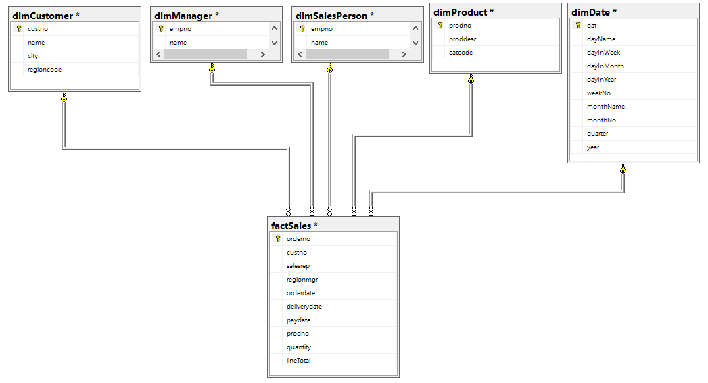

# Querying the CustomerSales DW

_Marco Langenhuizen, Fontys ICT & Business, May 2017_

## Introduction

This SQL exercise book consists of a demo part and an exercise part. In the demo part you will find annotated SQL queries that can be used as examples or prototypes for the exercises you have to solve yourselves. The idea is that if you understand the demo queries, you should be able to come up with a working solution for any of the exercise queries. They will be challenging though.

In class some of the demo queries will be live demoed. In addition, you can ask anything you want about any demo query. You won't get direct help on the exercise queries. It is your learning job to struggle your way through them with everything you know from the demo queries.

In addition to the edX Querying with Transact-SQL course where this exercise book is based on, you might want to look at the Mode Analytics SQL Tutorial for some more background on SQL or any other source of your preference.

Often a SQL result in table format is not easy to understand. That's why you're encouraged to use Excel to visualize the results of your queries. With Excel's Get&Transform functionality (formerly known as Power Query), it is very easy to reuse the queries in Excel after you've tested them in SSMS. You can then create a visual based on the resulting table in Excel.

## Data model

